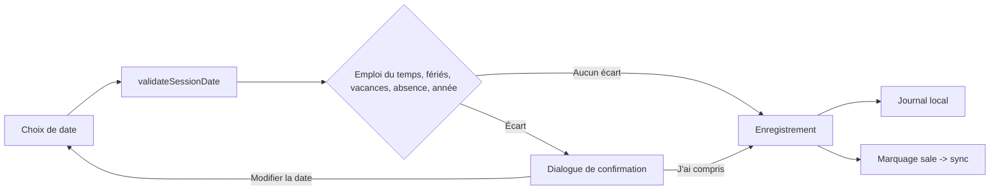
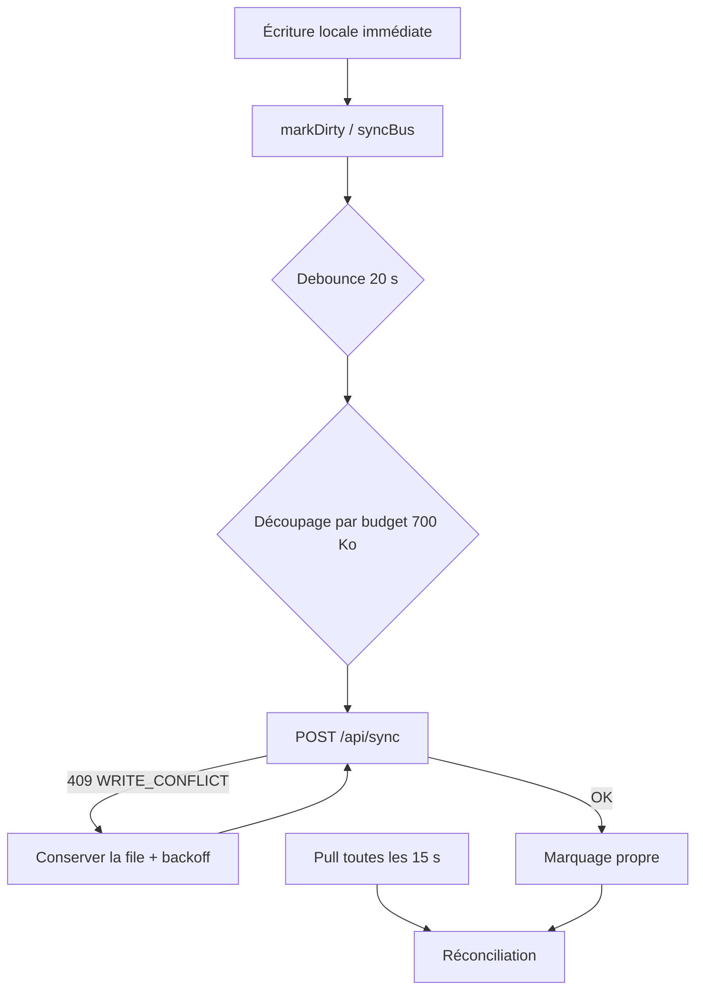
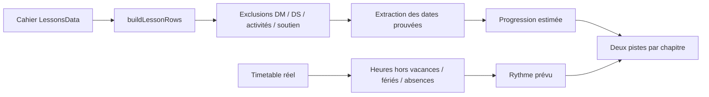

# Analyse — Mécanismes, fonctionnalités et règles

**Projet :** Mon cahier de textes interactif (`v1.1.0`)
**Périmètre :** application enseignant, administration, PWA, API serverless et référentiels officiels
**Sources relues :** `README.md`, `docs/ARCHITECTURE.md`, `docs/audit-parcours-professeur.md`, `docs/PILOTAGE_REFERENCE_AUDIT.md`, `docs/admin-sync-safety.md`, `docs/notifications-push-analysis.md`, `docs/PROGRESS_UI_AUDIT.md`, `docs/validation-entree-mobile.md`, `docs/GUIDE_BULLETIN_OFFICIEL_JSON.md`, `docs/GUIDE_CREATION_CONTENUS_JSON_FR.md`, `types.ts`, `utils/`, `api/`, `contexts/SyncContext.tsx`

> Ce document décrit le fonctionnement réel du code. Il ne réécrit pas la charte UX (voir `AGENTS.md`) mais la relie aux implémentations.

---

## 1. Synthèse exécutive

L'application est une **PWA offline-first** pour enseignants marocains, organisée en trois entrées distinctes :

| Entrée | Rôle | Technologie |
|---|---|---|
| Application enseignant | Classes, cahiers, évaluations, paramètres | `index.tsx` / `App.tsx` (React 19 + Vite) |
| Administration | Publication calendrier / bulletin / programmes | `admin.html` + `admin/` |
| Service worker | Précache, Web Push, clic système | `pwa/sw.ts` (Workbox) |

**Cinq principes structurants se dégagent du code :**

1. **Source unique de vérité.** `AppConfig.timetable` est la vérité de l'emploi du temps ; `schedules` est dérivé. `LessonsData` est la vérité du cahier ; les projections de progression en sont des fonctions pures, jamais un état parallèle.
2. **Dériver plutôt que dupliquer.** Progression, prochaine séance, alertes et rythme prévu sont recalculés depuis les données, jamais saisis à la main (`courseStartDate` est conservé pour compatibilité mais ignoré).
3. **Validation non bloquante.** Une date hors créneau, férié, vacances, absence ou hors année produit un **avertissement à confirmer**, jamais un refus.
4. **Règle métier sans React.** Toute règle de date, horaire, progression ou calendrier vit dans `utils/` et reste testable hors interface.
5. **Local d'abord.** Le stockage local est écrit avant le réseau ; le cloud ne consomme qu'un instantané marqué comme modifié.

**Point de vigilance transversal :** la garantie « notification application fermée » n'est portée que par le **push serveur** (`/api/notify` + cron). Les rappels de fin de séance reposent sur des minuteries JavaScript et ne survivent pas à la mort du processus — limitation assumée et documentée.

---

## 2. Modèle de domaine

Défini dans `types.ts`, il conditionne tous les mécanismes.

### 2.1 Entités principales

| Type | Rôle | Champs structurants |
|---|---|---|
| `ClassInfo` | Une classe de l'enseignant | `id`, `name`, `cycle`, `level`, `branch`, `group`, `curriculumChapterMatches` |
| `AppConfig` | Préférences + données transverses synchronisées | thème, emploi du temps, absences, évaluations, notifications |
| `TimetableEntry` | Une case de grille | `day` (0–6), `slot`, `classId`, `room` |
| `OfficialCurriculumPlan` / `OfficialChapter` | Répartition pédagogique officielle | `level`, `subject`, `weeklyHours`, `chapters[].allocatedHours` |
| `ManualAssessment` | Devoir saisi par le professeur | `type`, `num`, `dateISO`, `schoolYear` |
| `PedagogicalEvent` | Activité libre (diagnostic, olympiade…) | `type`, `status: planned \| done` |

### 2.2 Vocabulaires fermés (règles de typage)

- `Cycle = 'college' | 'lycee' | 'prepa'` — le profil peut porter plusieurs cycles.
- `AppLocale = 'fr' | 'en' | 'ar'` ; `ContentDirection = 'ltr' | 'rtl'` — **la direction du contenu d'un cahier est indépendante de la langue de l'interface**.
- `DevoirType = 'controle' | 'controle_court' | 'controle_global' | 'oral' | 'maison'` (nomenclature ministérielle).
- `allocatedHours: number | null` — `null` signifie **volume illisible ou non ventilé**, jamais zéro. Un volume inconnu **bloque les projections suivantes**.

### 2.3 Hiérarchie pédagogique

```text
contenu JSON
└── chapitre ou bloc spécial
    ├── sections[]        (champ `name`)
    │   ├── subsections[] (champ `name`)
    │   │   ├── subsubsections[] (champ `name`)
    │   │   │   └── items[]
    │   │   └── items[]
    │   └── items[]
    └── items[]
```

- Blocs principaux : `chapter`, `evaluation_diagnostic`, `devoir_maison`, `controle_continu`, `correction_devoir_maison`, `correction_controle_continu`.
- Les structures portent `name`, les items portent `title`.
- Deux formats acceptés : tableau direct, ou objet `{ header, lessonsData }` (alias `data`, `lessons`, `items`).
- Le fichier actuellement ouvert (`1ER bac sc math math.json`) suit exactement ce contrat : `chapter` → `sections[].name` → `subsections[].name` → `items[].type` avec titres LaTeX (`$...$`).

---

## 3. Mécanismes transversaux

### 3.1 Persistance locale prioritaire

- Clés locales : `appConfig_v1`, `classManager_v1`, `classData_v1_<classId>`, `editJournal_v1_<classId>`, `archives_v1_index`, `archive_v1_<id>`.
- L'éditeur écrit **après une courte temporisation**, puis **force l'écriture** sur `visibilitychange` (masquage), `pagehide` et démontage.
- Le cloud ne lit ensuite que cet **instantané local marqué comme modifié** → un onglet ne peut pas écraser une saisie en cours.
- `utils/notebookStorage.ts` mutualise les lectures JSON pour éviter les parsings répétés entre moteurs du tableau de bord.

### 3.2 Synchronisation et espace par compte

**Marquage du travail à envoyer** (`utils/syncBus.ts`) :

```text
modification → markClassDirty / markConfigDirty → file de synchronisation
              → SyncContext regroupe → POST /api/sync → réconciliation
```

| Règle | Valeur / comportement |
|---|---|
| Debounce de push | `PUSH_DEBOUNCE_MS = 20 000` ms |
| Budget par requête de push | `MAX_PUSH_BYTES = 700 000` octets (marge sous la limite serveur ~950 Ko) |
| Découpage | Chaque cahier est vérifié **individuellement** ; un dépassement lève `413` sans envoyer un lot surdimensionné |
| Pull | Toutes les **15 s** + au retour en ligne / premier plan |
| Rafraîchissement admin | **30 s**, jamais pendant l'édition d'un formulaire |
| Timeout requête | **30 000** ms, couvre aussi la lecture du corps |
| Backoff | `min(120 s, 5 s × 2^attempt)` avec jitter ±20 %, borné à **600 s** ; `Retry-After` respecté |
| Réessai | `status 0/408/429/≥500` ou code `WRITE_CONFLICT` ; `TypeError`/`SyntaxError` réseau |
| Concurrence | Téléchargements limités (`mapConcurrent`) pour préserver le téléphone |
| Conflit serveur | HTTP **409** + `WRITE_CONFLICT` : le client conserve sa file et réessaie |
| Garde multipartie | Seul le **premier lot** porte les métadonnées (liste de classes, réglages) et peut valider `acceptedClassIds` |

**Isolation par compte (`utils/accountWorkspace.ts`)** :

- Le propriétaire de l'espace est fixé **avant** qu'un retour `401` ne retire le cache de session.
- Connexion, inscription et déconnexion passent par `switchAccountWorkspace` : la dernière saisie est enregistrée, puis cahiers, réglages, archives, conflits et opérations en attente sont sauvegardés **sous le propriétaire sortant**.
- Le serveur vérifie `X-Workspace-Owner` contre la session authentifiée. Ce champ **n'accorde aucun accès** : la session reste l'autorité. Désaccord ou champ absent → **409**.
- Une erreur de sauvegarde **bloque** le changement ; une erreur de restauration tente un retour à l'espace précédent.
- Les données sans propriétaire vérifiable sont conservées sous `workspaceSnapshot_v1_unassigned_*` : **pas de fusion automatique**.

**Garde anti-réponse obsolète :** chaque opération capture propriétaire + révision d'espace ; une réponse tardive d'un ancien compte ne modifie ni le stockage actif ni sa file (testé sur un aller-retour A → B → A).

### 3.3 Emploi du temps

- `AppConfig.timetable` est la source enregistrée ; `deriveSchedules(config)` produit les `schedules` consommés par les alertes.
- `getDaySessionBlocks(timetable, weekday, clockPolicy)` produit les blocs horaires (`startMin`, `endMin`) ; `sessions: 2` conserve les séances doubles.
- `TimetableClockPolicy` applique un **décalage global** décidé par la direction, sans modifier les affectations des classes.
- Une vue ne modifie jamais un tableau dérivé : toute écriture passe par `timetable`.
- Les écarts horaires et les classes sans créneau remontent via le flux de notifications dans le **Centre de pilotage** (le panneau d'avertissements redondant des paramètres a été retiré).

### 3.4 Validation des dates (`utils/dateValidation.ts`)

Circuit unique : **toutes** les entrées de date convergent vers `validateSessionDate`, qui croise 5 sources :

| # | Contrôle | Type d'avertissement |
|---|---|---|
| 1 | L'enseignant a-t-il cette classe ce jour-là ? (emploi du temps) | `not-scheduled` |
| 2 | Jour férié (nom localisé, mention « estimé » si approximatif) | `holiday` |
| 3 | Vacances scolaires | `vacation` |
| 4 | Absence justifiée (maladie, congé) | `absence` |
| 5 | Année scolaire (référence stricte si `schoolYearStart` choisi, sinon multi-années connues) | `out-of-year` |

- Format strict `YYYY-MM-DD` ; une date non conforme ne produit **aucun** avertissement (silence, pas de faux positif).
- Les avertissements sont **non bloquants** : l'interface propose « Modifier la date » ou « J'ai compris, enregistrer ».
- Un écart est une **information à confirmer**, jamais une faute ni un toast fugitif ; il alimente le journal d'activité.

### 3.5 Progression et cycle de vie des chapitres

**Moteur** : `utils/chapterLifecycle.ts`, via `buildLessonRows` (parcours commun écran/impression).

| Règle | Détail |
|---|---|
| Parcours | items directs, puis sections et descendants — l'ancien parcours concurrent (sections avant items) est supprimé |
| Cache | Un passage structurel est mis en cache par instantané immutable ; les dates sont réévaluées selon le jour courant |
| Exclusions | DM, DS/contrôles, corrections, diagnostics, activités (aliases FR/EN), soutien, remédiation, examens — **tout le sous-arbre est exclu**, sans heuristique sur le titre |
| Preuve de début | Un **titre de chapitre daté** prouve un début. Un titre daté **sans contenu** = « en cours », jamais « terminé » |
| Preuve de fin | Le **dernier contenu daté** termine le chapitre, même si des dates intermédiaires sont vides |
| Fin multiple | Plusieurs parties associées au même chapitre officiel doivent **toutes** être terminées |
| Date manquante | Titre non daté mais contenu daté → « date de début manquante » |
| Date invalide | Hors année ou contradictoire → état « à vérifier », taux indisponible |
| Heures | Les projections consomment les heures des **blocs réels** de l'emploi du temps, hors vacances/fériés/absences ; `reservedHours` réserve les évaluations confirmées ; **aucune fenêtre indicative ne consomme automatiquement** |
| Volume inconnu | Bloque les projections suivantes ; aucune date inventée |
| Identifiants | Les liens conservent **index + titre exact** ; suppression/déplacement/renommage invalide prudemment l'association |
| Unicité | Un chapitre du cahier → un seul chapitre du programme ; plusieurs parties du cahier → le même chapitre autorisé |

**Affichage** : deux pistes alignées par chapitre — couleur du thème pour l'avancement estimé des contenus datés, gris ardoise pour le rythme prévu. Textes et rôles accessibles distinguent les deux **sans dépendre uniquement de la couleur**.

### 3.6 Évaluations

**Trois sources fusionnées dans une seule fonction métier** (`utils/assessments.ts`) : planning officiel → dates ajustées par le professeur → devoirs manuels.

- Le JSON officiel est **validé à l'exécution** ; les identifiants incluent le **millésime scolaire**, ce qui empêche un devoir de réapparaître l'année suivante.
- Les anciennes clés sans année restent lisibles **pour migration uniquement**.
- Alertes, modal d'évaluations et rappels d'absences consomment **la même liste résolue**.
- `utils/assessmentSync.ts` rapproche chaque devoir d'un bloc du cahier par **type + numéro + proximité de date**, sans réutiliser le même bloc (`used` set).
- Les règles officielles vivent dans `public/assessment-rules.json` (ex. mathématiques collège : 3 contrôles, semaines 5 et 10 + fenêtre de fin de semestre, 60/60/120 min selon le niveau).
- L'API valide les structures avant écriture Redis.

### 3.7 Contenus prédéfinis et import

- **Règle d'or du diagnostic initial** : tout contenu de classe commence par un bloc `evaluation_diagnostic`. S'il est absent, l'application l'**ajoute en première position** ; s'il existe, il est conservé, remonté et renommé (`Évaluation diagnostique 1`).
- En **mode ajout**, aucun doublon n'est créé : le diagnostic déjà présent est conservé.
- `utils/predefinedContent.ts` lit `public/contenus/manifest.json` (cache mémoire, `no-cache`) puis charge le contenu correspondant à la classe.
- Le manifeste ne stocke que le nom de fichier ; le dossier est déduit.
- `composeAdminLessonImport` applique le diagnostic **après composition du cahier final**, en ajout comme en remplacement, et **conserve la direction du cahier existant** en mode ajout.

### 3.8 Notifications — trois couches distinctes

| Couche | Déclencheur | App fermée ? | Autorité |
|---|---|---|---|
| Alerte dans l'application | `useNotificationFeed` + préférences | Non | `notificationSettings.enabled` |
| Rappel local de fin de séance | `useSessionAlerts` + `setTimeout` + Service Worker | Non (page vivante) | Appareil courant |
| Push serveur | `/api/notify` + cron Vercel + Web Push | **Oui** | Abonnement Redis |

**Détecteur pur** (`utils/sessionAlertEngine.ts`) :

- Horloge fixée sur **Africa/Casablanca** (`moroccoClockMinutes`), pas sur le fuseau de l'appareil.
- Aucune alerte si : absence du professeur, hors année scolaire effective.
- Vacances/fériés : `current` est vidé ; les événements sont coupés si `quietDuringVacations`.
- Avance de rappel : `sessionReminderMinutes`, défaut **1 min**, borné 1–10.
- Grâce « date absente » : `missingDateReminderMinutes`, défaut **5 min**, borné 1–30.
- **Fenêtre de fraîcheur de 60 s** : survit aux re-rendus ordinaires mais ne sonne jamais après une séance terminée.
- Filtre les classes supprimées ; claims par compte et créneau (`cdt-session-end-<date>-<fin>`, `cdt-session-missing-…`).

**Push serveur (`api/notify.ts`)** :

- Cron protégé par `CRON_SECRET` ; un snapshot invalide est isolé, pas bloquant.
- Anti-spam : pas de nouvelle alerte pendant **2 jours** sauf aggravation.
- `lastNotifiedAt` n'est mis à jour **que si au moins un appareil a été livré**.
- Purge des réponses fournisseur **404/410** ; TTL serveur **24 h** (1 h pour un test).
- Abonnement : endpoint réservé atomiquement dans `push:endpoint-owners`, rattaché au téléphone, **max 5 appareils**.
- Trois états **jamais fusionnés en un booléen** : `permission`, `subscribed`, `serverRegistered`. `pushEnabled` n'est marqué vrai que si les trois sont positifs.
- Désactivation : abonnement local retiré **en premier**, suppression serveur tentée ensuite ; si le réseau échoue, l'interface le dit et invite à réessayer.

### 3.9 Journal d'activité

- `utils/journal.ts` : **60 entrées maximum** par classe (`MAX_ENTRIES = 60`), clé `editJournal_v1_<classId>`.
- Libellés d'opérations traduits **FR / AR / EN** (`opLabel`), avec temps relatif localisé (`timeAgo`).
- Consultable depuis le **centre de notifications global** (retiré de l'éditeur).

### 3.10 Sauvegarde et archives

- `buildFullBackup()` agrège `appConfig_v1`, `classManager_v1` et chaque `classData_v1_*`.
- `restoreBackup(data)` : restaure les classes, réécrit les métadonnées de synchronisation (`SyncMeta`) et **retourne le nombre de classes restaurées** ; les classes précédentes non présentes sont gérées.
- Archives annuelles (`utils/archives.ts`) : index `archives_v1_index`, entrées `archive_v1_<id>`, export par téléchargement.

### 3.11 Rendu de l'éditeur

| Mécanisme | Règle |
|---|---|
| `buildLessonRows` | Aplatit le cahier en **conservant les indices source** |
| Recherche | Filtre ces lignes avec leurs ancêtres ; **ne reconstruit pas un arbre** aux indices différents |
| `groupLessonRows` | Regroupe dates et contenus consécutifs identiques, **sans traverser** séparateurs ni trous de recherche |
| Cellule fusionnée | Sélectionne toutes ses entrées, dont les données restent distinctes ; des descriptions différentes empêchent la fusion |
| Groupes | Bornés à **24 entrées** |
| Virtualisation | Intersection réelle avec la fenêtre, mesures indexées par identité, positions arrondies au pixel ; les corrections de hauteur au-dessus de la fenêtre préservent la position de lecture |
| LaTeX | `splitMathText` protège les délimiteurs **avant** listes/surlignage ; MathJax ne scanne pas globalement le DOM : chaque `MathText` possède son rendu |
| Performance | Les modales lourdes sont chargées à la demande depuis `EditorModals.tsx` |

### 3.12 Thème, i18n et RTL

- `ThemeCustomization` : accent (y compris couleur personnalisée), rayon, style de carte, style de tableau, police UI, contraste de fond, couleurs personnalisées fond/texte/carte.
- `ThemeMode = 'light' | 'dark' | 'system'`.
- Deux polices de contenu indépendantes : latine et arabe (Lateef par défaut en arabe, y compris dans les réinitialisations et fallbacks).
- i18n : `i18n/LocaleProvider.tsx`, audit `npm run check:i18n` — l'audit a déjà validé **1 013 clés dans chaque langue**, sans écart.
- RTL : le sens de lecture du **contenu** est porté par `contentDirection` sur le cahier, indépendamment de la langue d'interface ; le rendu des tableaux d'impression s'y adapte.

---

## 4. Fonctionnalités par domaine

| Domaine | Fonctionnalités | Règles clés |
|---|---|---|
| `features/auth` | Connexion, inscription, préparation de classe avant inscription | Aucune donnée de classe enregistrée avant inscription réussie ; brouillon **en mémoire** uniquement (perte au rechargement annoncée) ; `#register` sans préparation valide renvoie vers `#start` |
| `features/dashboard` | Mes classes, 3 indicateurs compacts, centre de notifications, calendrier mensuel unifié, cartes, onboarding | Le calendrier croise vacances/fériés, bulletin officiel, évaluations, absences et emploi du temps ; les calculs viennent de `utils` et des hooks, jamais redéfinis ici |
| `features/editor` | Tableau, lignes, sélection, impression, recherche, analyse et progression, modales | Détail §3.11 ; journal déplacé vers le centre de notifications |
| `features/evaluations` | Évaluations, parcours officiel, concours, activités pédagogiques, absences | **Aucune sélection parallèle de classe** ; tout reste lié à la classe active |
| `features/settings` | Profil, emploi du temps, notifications, données, archives, compte | Seuls les champs de profil modifiés forment le brouillon ; apparence/langue/notifications/emploi du temps s'appliquent **en direct** et ne sont pas annulés par l'abandon du profil |
| `features/guide` | Guide FR/AR, rendu Markdown léger, images, RTL | Chargé à la demande |
| `features/messages` | Messages de la direction, lecture et retour visible | Garde de compte contre une réponse obsolète après changement de compte |
| `admin/` | Publication calendrier, bulletin officiel JSON, programmes, vue d'ensemble | Écritures par compte atomiques ; rafraîchissement 30 s ; login limité à 8 tentatives / 15 min → HTTP 429 |
| `api/` | Auth, sync, notify, calendar, official-events, messages, admin | `api/_lib` porte les helpers privés (Redis, auth, validation, webpush, écriture atomique) |

---

## 5. Règles

### 5.1 Règles d'architecture (`docs/ARCHITECTURE.md`)

```text
Entrées → Features → Hooks/Contexts/Utils → infrastructure externe
                 ↘ Components UI
```

1. Une primitive UI n'importe **jamais** une feature.
2. Une règle métier n'importe **jamais** React.
3. Une feature peut consommer primitive, hook, contexte ou règle.
4. Deux features communiquent par **donnée ou petite interface explicite**, jamais par copie de logique.
5. Le client ne partage **pas** directement les helpers secrets de `api/_lib`.
6. Imports inter-domaines via `@/` ; imports internes à une feature en relatif.
7. Un fichier temporaire, un rendu PDF ou un script ponctuel n'est **jamais** versionné.
8. Toute suppression est prouvée par `check:unused`, puis TypeScript et build.

**Placement d'un nouveau fichier :** écran → `features/<domaine>` ; primitive → `components/ui` ; état React réutilisé → `hooks` ; règle pure → `utils` ; secret → `api/_lib` ; donnée officielle → `public` avec validation.

### 5.2 Règles métier (invariants vérifiés)

- Un devoir manuel porte un `schoolYear` obligatoire à l'usage : il ne réapparaît pas l'année suivante.
- Un groupe est un **entier de 1 à 99** ; les zéros initiaux sont ignorés (`٠` → refusé, `٣` → `3`).
- Une classe garde sa matière et son cycle réels, **même s'ils ne figurent plus** dans la sélection du profil.
- Un écart de date est **confirmé**, jamais bloqué.
- Une date future n'est **jamais** présentée comme « dernière séance ».
- « Contenu prochain » suit l'ordre pédagogique du tableau et ne dépend **pas** de l'emploi du temps.
- Un volume horaire inconnu (`null`) bloque la projection : **aucune date inventée**.
- Un titre daté sans contenu reste « en cours ».
- Les comparaisons de cahiers sont des **indicateurs de saisie**, pas une mesure certifiée de progression du programme.
- Un cahier enregistre des **jours**, pas l'heure de saisie : une date ne prouve pas deux séances distinctes du même jour.

### 5.3 Règles UX/UI (`AGENTS.md`)

| Axe | Règle |
|---|---|
| Charge cognitive | Loi de Hick + chunking 7 ± 2, divulgation progressive |
| Conventions | Loi de Jakob : grilles horaires, tableaux de bord, conformité aux bulletins |
| Cibles | ≥ **44 px** (`touch-target`), actions stratégiques dans la zone du pouce |
| Layout | Bento/CSS Grid, espacements mathématiques, **rayon intérieur = rayon extérieur − padding** |
| États vides | Jamais de surface vide passive : icône, message d'orientation, CTA contextuel |
| Couleurs | **60-30-10** ; accent réservé aux CTA/indicateurs ; icônes neutres par défaut |
| Neutres | Fond teinté 1–5 % de la teinte primaire ; bordures fines plutôt qu'aplats colorés |
| Interdits | Pas de noir pur (#000000) ni blanc pur (#FFFFFF) sur grands aplats ; le mode sombre n'est **pas** une inversion |
| Sémantique | Rouge = destructif, vert = succès, ambre = avertissement — **indépendant de la marque** |
| États | Hover +10 % de luminosité, pressé −10 % + micro-compression, désactivé désaturé/50 % |
| Micro-interactions | Spring physics, transitions 60 fps, `prefers-reduced-motion` respecté |

### 5.4 Règles de sécurité

- Sessions signées dans des cookies **`HttpOnly`** ; mots de passe hachés **`scrypt`**.
- `X-Workspace-Owner` vérifié côté serveur, **sans conférer d'accès** (403/409 sinon).
- Écriture admin : budget atomique **8 tentatives / 15 min / adresse** ; hors Vercel, limite commune (on ne croit pas un en-tête client).
- `beginAccountWrite` **avant toute lecture** dont dépend une écriture ; révision comparée dans le même script Redis ; conflit → 409 sans appliquer le lot.
- `revision:account:*` **jamais effacée** à la suppression : empêche une requête ancienne de réécrire après re-création du compte.
- Snapshots locaux **non chiffrés** : séparation fonctionnelle des comptes, pas protection contre un accès au stockage navigateur (limite documentée).

### 5.5 Règles de qualité et CI

```bash
npm run check:data        # validation des référentiels + curriculum + contenus
npm run lint              # tsc --noEmit
npm run check:architecture# + noUnusedLocals / noUnusedParameters
npm run check:unused      # knip
npm run build             # app + serveur + service worker
npm run check             # chaîne complète
```

Tests ciblés : `test:pilotage` (40), `test:editor` (11), `test:notifications` (11), `test:admin-sync`, `check:i18n`.

**Budget performance :** README annonce **220 kB** par chunk non compressé ; `ARCHITECTURE.md` mentionne un avertissement au-delà de **320 kB** — **les deux chiffres divergent dans la documentation** et méritent d'être alignés (voir §7).

---

## 6. Circuits de bout en bout

### 6.1 Enregistrement d'une date



### 6.2 Synchronisation



### 6.3 Progression d'un chapitre



---

## 7. Limites assumées et points de dette

| # | Limite / dette | Impact |
|---|---|---|
| 1 | Rappels locaux inopérants **application complètement fermée** | Documenté honnêtement ; solution = push serveur planifié ou `@capacitor/local-notifications` |
| 2 | `localStorage` **sans transaction inter-onglets** | La concurrence multi-onglets reste un risque résiduel |
| 3 | Snapshots locaux non chiffrés | Séparation fonctionnelle, pas protection contre un accès physique/logiciel au navigateur |
| 4 | Backups sans propriétaire → `workspaceSnapshot_v1_unassigned_*` | Récupération contrôlée requise, pas de fusion automatique |
| 5 | Budget de chunk : **220 kB (README) vs 320 kB (ARCHITECTURE)** | Documentation contradictoire à trancher |
| 6 | Un `tsc` global resterait bloqué par des exports préexistants absents (`ClassDraft`, `ClassDraftValidation`, `defaultLevelForCycle`, `resetSyncState`) selon l'audit de pilotage | Dette de nettoyage à confirmer sur l'état actuel |
| 7 | Avertissement de développement sur l'import de `public/vacances-jourferie.json` | Non traité, sans blocage de build |
| 8 | Connexion réelle à deux comptes et synchronisation cloud multi-appareils **non validées** au niveau recette | Risque de mise en service |
| 9 | Référentiels pédagogiques = **répartitions d'enseignants**, pas textes ministériels certifiés | La documentation l'assume et ne revendique aucune certification |

---

## 8. Recommandations prioritaires

1. **Trancher la question du réveil application fermée** : choisir explicitement entre un cron Push serveur horaire (approximatif) et `@capacitor/local-notifications` (exact), puis l'inscrire dans l'architecture. Aujourd'hui les deux sont à l'état d'options.
2. **Aligner la documentation sur le budget de chunk** (220 kB vs 320 kB) et vérifier la valeur réellement appliquée par `vite.config.ts`.
3. **Verrouiller la recette multi-comptes / multi-appareils** sur l'API réelle : c'est la principale zone non couverte par les tests locaux.
4. **Ajouter des métriques par étape** sur le circuit push (`permission_granted`, `subscription_created`, `server_registered`, `delivered`, `expired`), sans contenu ni endpoint en clair.
5. **Poursuivre le nettoyage des exports orphelins** signalés par l'audit de pilotage, avec preuve `check:unused` + build.
6. **Formaliser un test inter-onglets** (Web Locks si disponible, sinon best effort) pour documenter la limite de concurrence et détecter une régression.

---

## 9. Conclusion

L'application présente une **architecture en couches cohérente et défendable** : règles métier pures dans `utils/`, orchestration dans `hooks/` et `contexts/`, primitives isolées, et trois couches de notification aux garanties explicitement distinguées. Les mécanismes les plus aboutis sont la **validation de date non bloquante**, le **cycle de vie des chapitres** (dérivé, jamais saisi) et la **synchronisation avec isolation par compte et gestion de conflits**.

Les risques résiduels ne sont pas architecturaux mais de **garantie et de recette** : réveil applicatif fermé, concurrence multi-onglets, validation cloud réelle et cohérence documentaire. Les traiter relèverait moins d'une refonte que d'arbitrages explicites et de tests de recette ciblés.
