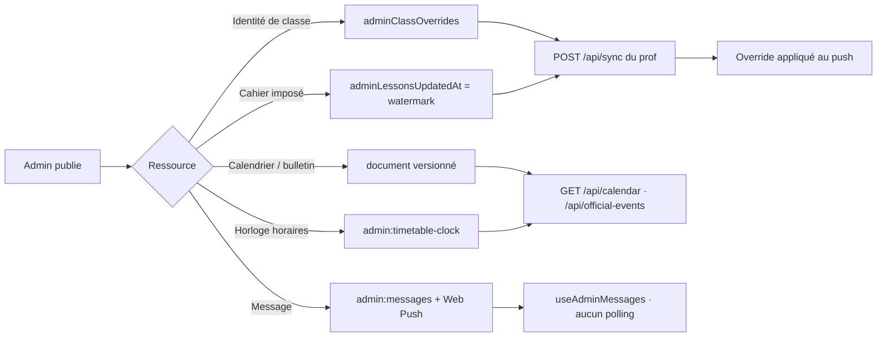
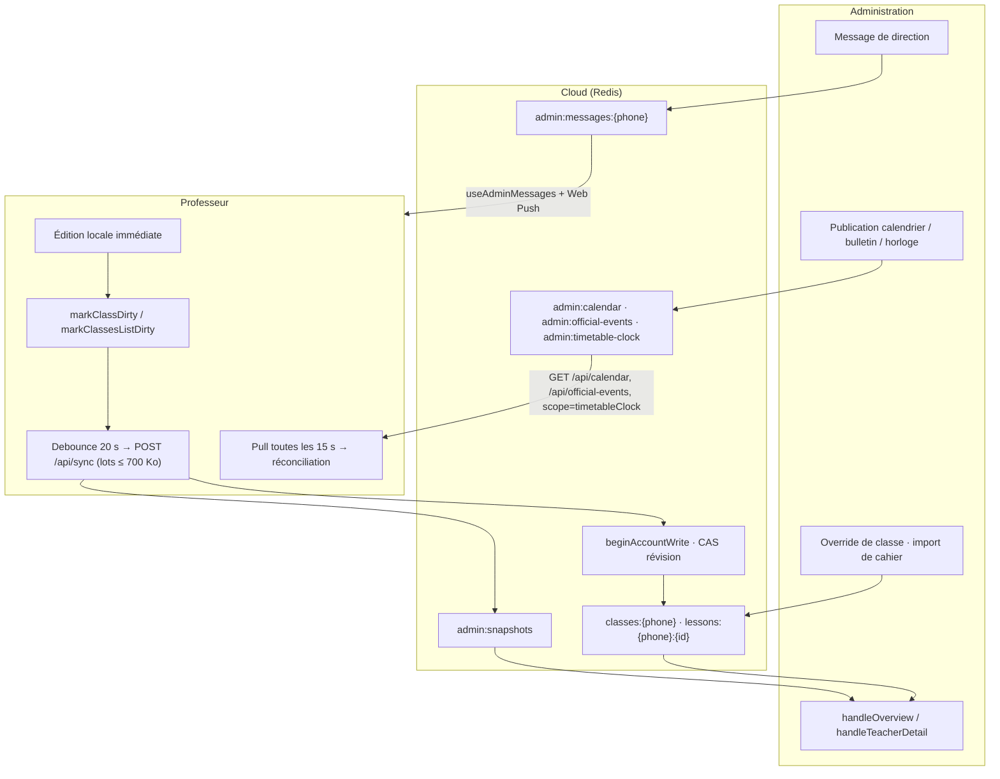

# Audit complet — Lien admin ↔ professeur · Fluidité & performance · Adaptation mobile & tactile

**Projet :** Mon cahier de textes interactif (`v1.1.0`)
**Date :** 12 septembre 2026
**Périmètre :** `api/`, `admin/`, `contexts/`, `hooks/`, `features/`, `utils/`, `pwa/`, `index.css`, `vite.config.ts`
**Nature :** audit technique en lecture seule

---

## 0. Méthode et statut de vérification

| Statut | Signification |
|---|---|
| ✅ **Vérifié** | Constaté directement dans un fichier par lecture ou recherche (chemin + ligne cités) |
| 🔎 **Exploré** | Relevé lors de l'exploration du code, non re-vérifié ligne à ligne |
| ⚠️ **Non exécuté** | Aucune mesure runtime, aucun build, aucun test matériel dans cet audit |

- Aucun fichier n'a été modifié hors la présente note.
- Aucun build n'a été lancé : les tailles de chunks réelles ne sont **pas** mesurées, seuls les seuils configurés sont vérifiés.
- Aucun appareil physique n'a été testé : les conclusions mobiles proviennent du code et de la documentation, pas d'un iPhone/Android réel.

---

## 0bis. Suivi des corrections — 12 septembre 2026

Résultat de la passe de rectification. Un finding s'est révélé être un **faux positif** après vérification approfondie ; il est invalidé et non « corrigé ».

| # | Finding initial | Statut | Preuve / décision |
|---|---|---|---|
| **F-01** | Précache PWA cassé | **Corrigé** | `includeAssets` réparé dans `vite.config.ts` (noms `.json` rétablis + `contenus/manifest.json`) et route `StaleWhileRevalidate` sur `/contenus/` dans `pwa/sw.ts` |
| **F-02** | Blocage admin hors verrou | **Corrigé** | `handleBlockTeacher` passe par `beginAccountWrite` (`api/admin.ts`) |
| **F-03** | Accusé de message non atomique | **Corrigé** | `handleAcknowledge` (`api/messages.ts`) **et** `handleNotifyTeacher` (`api/admin.ts`) partagent la révision de compte |
| **F-04** | Snapshot lié au 1er lot | **Faux positif — invalidé** | Si le 1er lot échoue, la boucle s'arrête, `pushedIds` reste vide et `clearPendingWork` n'est **pas** appelé : le travail demeure sale et le push suivant renvoie un snapshot recalculé. Aucune perte de donnée. |
| **F-05** | Override admin sans sortie | **Ouvert — décision produit** | Cohérent avec « la direction possède l'identité ». À trancher explicitement plutôt qu'à corriger par défaut. |
| **F-06** | Duplication du mock de dev | **Ouvert** | `server.ts` conserve sa réimplémentation, non couverte par `test:admin-sync`. |
| **F-07** | `pushEnabled` ambigu | **Clos — documentaire** | Le type `TeacherSnapshot.notifyPrefs` et `assertValidTeacherSnapshot` le prévoient explicitement : c'est une remontée **en lecture seule** vers l'admin. Commentaires clarifiés dans `types.ts` et `utils/syncSettings.ts`. |
| **F-08** | Budget non bloquant | **Corrigé** | En mode `analyze`, le plugin appelle `this.error` au-delà de 320 kB. |
| **F-09** | `analyze` sans analyseur | **Corrigé** | En mode `analyze`, rapport trié `[bundle-size]` par chunk, **sans nouvelle dépendance**. |
| **F-10** | Orientation liée au viewport | **Corrigé** | `useOrientation` s'appuie sur `screen.orientation` (stable sous clavier virtuel) ; la media query ne sert plus que de repli. |
| **F-11** | Haptique vs `sessionVibration` | **Clos — intentionnel** | `sessionVibration` ne régit que les rappels de séance. Les retours de boutons relèvent du confort d'interface ; leur portée est désormais explicitée dans `types.ts`. |
| **F-12** | `[]` alloué à chaque rendu | **Corrigé** | Constante `NO_DESCRIPTION_TYPES` dans `features/editor/MainTable.tsx`. |
| **F-13** | `devApiMockPlugin` fantôme | **Corrigé** | `config/features.ts` référence `setupMockApi` (`server.ts`). |
| **F-14** | Analytics annoncées, absentes | **Corrigé** | Mentions retirées de `README.md` et `docs/ARCHITECTURE.md`. |
| **F-15** | 220 kB (doc) vs 320 kB (code) | **Corrigé** | `README.md` aligné sur `CHUNK_WARN_LIMIT_KB = 320`. |
| **F-16** | `npm run analyze` inopérant | **Corrigé** | Voir F-08 et F-09. |
| **F-17** | En-tête mort `/vacances-jourferie.json` | **Corrigé** | Entrée supprimée de `vercel.json` (fichier importé, donc bundlé). |
| **F-18** | Breakpoints non alignés | **Ouvert** | JS 767/1023, CSS 639/767/960, Tailwind 640/768/1024 : la grille officielle reste à documenter. |

**Trois findings restent ouverts** : F-05 et F-06 (décisions/chantiers) et F-18 (documentation d'une convention). Aucun n'est un défaut de sécurité ou de perte de donnée.

---

## 1. Synthèse et verdict

**Verdict global : architecture solide, exécution soignée sur les trois axes, mais cinq défauts concrets et une dizaine d'incohérences de documentation à corriger.**

| Axe | Niveau | Constat |
|---|---|---|
| Lien admin ↔ prof | **Bon, à durcir** | Un modèle de propriété des données clair et cohérent, un verrou CAS atomique unique ; trois failles de concurrence ou de propagation |
| Fluidité & performance | **Bon** | Découpage de cache réellement indépendant, virtualisation ciblée, aucun polling inutile côté prof ; garde-fous de budget inefficaces |
| Mobile & tactile | **Bon** | Conventions tactiles homogènes, safe-area traitée partout, pas de débordement du tableau ; angles morts clavier virtuel et tests matériels |

### Les 5 défauts prioritaires (tous ✅ vérifiés)

| # | Défaut | Sévérité |
|---|---|---|
| **F-01** | `includeAssets` PWA cassé (4 noms de fichiers tronqués) → les référentiels JSON chargés à l'exécution **ne sont jamais précachés** | **P1** |
| **F-02** | `handleBlockTeacher` écrit le compte **hors** du verrou de révision | **P1** |
| **F-03** | `handleAcknowledge` (accusé de message admin) fait un *read-modify-write* non atomique | **P1** |
| **F-04** | ~~Le snapshot prof→admin n'est poussé qu'avec le **1er lot** ; s'il échoue, la vue admin ne se met jamais à jour~~ — **invalidé après vérification** (voir §0bis) | — |
| **F-05** | Une classe administrée (`adminClassOverrides`) **n'est jamais libérée** par une édition prof | **P1** |

### Les incohérences documentaires (✅ vérifiées)

| # | Incohérence |
|---|---|
| **F-13** | `devApiMockPlugin` cité comme existant dans `vite.config.ts` — **il n'existe pas** (le mock réel est `setupMockApi` dans `server.ts`) |
| **F-14** | Analytics annoncées dans `README.md` et `ARCHITECTURE.md` — **aucune trace dans le code** |
| **F-15** | Budget de chunk : `README.md` annonce **220 kB**, `config/optimization.ts` applique **320 kB** |
| **F-16** | `npm run analyze` existe sans analyseur ni branche `mode === 'analyze'` |
| **F-17** | `vercel.json` définit `Cache-Control: no-cache` pour `/vacances-jourferie.json`, fichier **importé** (donc bundlé), entrée sans effet |

---

## 2. Axe 1 — Lien admin ↔ professeur (bidirectionnel)

### 2.1 Modèle de propriété des données

Le principe est explicite dans le code : **la direction possède l'identité, le professeur possède sa pédagogie.**

| Donnée | Propriétaire | Preuve |
|---|---|---|
| Nom, matière, cycle, `teacherName` de la classe | **Admin** | `api/admin.ts` → `ClassesBlob.adminClassOverrides[id]` ; `api/sync.ts:140-147` |
| Suppression de classe | **Admin** | tombstone `deletedClasses[id] = { deletedAt }` |
| `courseStartDate`, `curriculumSourceId`, `curriculumChapterMatches` | **Professeur** | réinjectés par `withCurriculumSettings` — *« The direction owns class identity, not the teacher's course start or links »* |
| `lessonsData` (cahier) | **Partagé**, arbitré par watermark | `adminLessonsUpdatedAt[id]` ; toute leçon `updatedAt <= watermark` est rejetée |
| Dates de devoirs | Réglages (LWW) | `settings.assessmentDates` |
| Horloge d'emploi du temps | **Admin**, hors LWW | `admin:timetable-clock` (global) + `admin:timetable-clock:{phone}` (assignation), versionnés |
| Calendrier vacances / bulletin officiel | **Admin**, versionné | `admin:calendar`, `admin:official-events` via `saveVersionedDocument` |
| Messages de direction | **Admin** | `admin:messages:{phone}` (max **60**) + Web Push |
| Blocage / suppression de compte | **Admin** | `user.blocked`, `deleteTeacher` |

```ts
// api/sync.ts:144-146  ✅ vérifié
const adminClass = adminClassOverrides[classId];
// The direction owns class identity, not the teacher's course start or links.
return adminClass ? withCurriculumSettings(adminClass, teacherClass ?? adminClass) : teacherClass!;
```

```ts
// utils/classCurriculumSettings.ts:4-10  🔎 exploré
export function withCurriculumSettings(base: ClassInfo, settings: ClassInfo): ClassInfo {
  return { ...base,
    courseStartDate: settings.courseStartDate,
    curriculumSourceId: settings.curriculumSourceId,
    curriculumChapterMatches: settings.curriculumChapterMatches };
}
```

### 2.2 Sens ADMIN → PROFESSEUR



| Mécanisme | Détail | Statut |
|---|---|---|
| Identité de classe | L'override réimpose nom/matière/cycle à chaque push ; les réglages pédagogiques du prof sont réinjectés | ✅ |
| Cahier imposé | `handleImportClassLessons` écrit le blob + watermark `adminLessonsUpdatedAt[id] = now` ; le push prof rejette les leçons plus anciennes que le watermark et les signale dans `acceptedClassIds` | ✅ |
| Calendrier / bulletin | `saveCalendar` / `saveOfficialEvents` versionnés → `GET /api/calendar` (`max-age=60, stale-while-revalidate=300`) et `GET /api/official-events` | 🔎 |
| Horloge horaires | `resolveTimetableClock` renvoyée au pull mais **jamais réinjectée dans le LWW prof** — c'est une décision d'architecture correcte | ✅ |
| Messages | Push Web Push `tag: cdt-admin-…`, TTL **86 400 s**, `urgency:'high'`, `url:/#/notifications` ; côté prof lecture au boot + `visibilitychange` + message SW — **aucun polling** | ✅ |
| Blocage compte | `blocked=true` → `requireUser` refuse | ✅ |

### 2.3 Sens PROFESSEUR → ADMIN

| Mécanisme | Détail |
|---|---|
| **Snapshot de progression** | `computeTeacherSnapshot` (`utils/progression.ts`) → `TeacherSnapshot` (classes, `totalItems`, `plannedCount`, `completionRate`, `sessionsCount`, `lastDate`, `weekdays`, `scheduleSlots`, `sessionsPerWeek`, `notifyPrefs`, `absences`, `schoolYearStart`, `applicationLocale`, `lastSyncAt`) → poussé dans le champ `snapshot` du **premier lot** → hash Redis `admin:snapshots` |
| **Liste de classes / emploi du temps / réglages** | blob `classes:{phone}` via `/api/sync` |
| **Lecture admin** | `handleOverview` lit `admin:snapshots` + `user` + `admin:messages` en pipeline, ajoute `blocked`, `pendingMessages`, `lastMessageAt`, trie par `lastSyncAt` décroissant |
| **Détail enseignant** | `handleTeacherDetail` ajoute classes, schedules, classMeta, snapshot, assessmentDates, printSettings, **20 derniers** messages |
| **Progression agrégée** | `globalCompletion` (somme planned/total) dans `admin/utils.ts` |
| **Retard (lateness)** | ⚠️ **ne remonte pas vers l'admin** : calculé côté serveur pour notifier le **prof** (cron `0 17 * * *` → `api/notify.ts`), anti-spam 2 jours sauf aggravation |

> **Point de conception à noter :** il n'existe pas de flux prof→admin d'historique ou de séries temporelles. L'admin voit un **instantané** (l'état le plus récent), jamais une évolution.

### 2.4 Invariants et limites ✅ vérifiés

| Invariant | Valeur | Fichier |
|---|---|---|
| Révision de compte CAS (Lua), sans lock expirant | `revision:account:{phone}` | `api/_lib/atomicWrite.ts` |
| Conflit d'écriture | HTTP **409** `WRITE_CONFLICT` | `api/_lib/atomicWrite.ts:36` |
| Compte supprimé pendant l'écriture | `return -1` → 404 | `api/_lib/atomicWrite.ts:34` |
| Propriétaire d'espace ≠ session | **409**, n'accorde **aucun** accès | `api/_lib/workspaceOwner.ts` |
| Taille max du corps serveur | `MAX_BODY_BYTES = 950_000` | `api/_lib/validate.ts:14` |
| Budget push client | `MAX_PUSH_BYTES = 700_000` | `contexts/SyncContext.tsx:42` |
| Session professeur | 30 jours | `api/_lib/auth.ts:18` |
| Session admin | 12 heures | `api/_lib/auth.ts:19` |
| Login prof | **10** tentatives / **300 s** (reset au succès) | `api/auth.ts:32-33` |
| Login admin | **8** tentatives / **900 s** par IP hachée | `api/_lib/adminLoginLimit.ts` |
| Messages admin par enseignant | **60** stockés, **20** affichés | `api/_lib/adminMessages.ts:3` |
| Abonnements push | **5** max, endpoint ≤ 2048, clé ≤ 512 | `api/notify.ts:18-21` |
| Snapshot borné | classes ≤ 120, weekdays ≤ 14, absences ≤ 200, motif ≤ 240 | `api/_lib/validate.ts:76-165` |
| Offset horaire admin | borné | `api/admin.ts` |
| Poll admin | **30 000 ms** | `admin/AdminApp.tsx:78` |

### 2.5 Forces

- **Un seul verrou d'écriture** (CAS Lua) partagé par toutes les écritures de compte : pas de lock à expiration, pas de deadlock.
- **Tombstones durables** (`deletedClasses`) qui empêchent la résurrection d'une classe supprimée.
- **Watermark d'import admin** : la direction peut imposer un cahier sans que le prof ne l'écrase par un push retardé.
- **Horloge admin tenue hors du LWW** : une décision de direction ne peut pas être écrasée par un réglage local.
- **Boîte de réception sans polling** (push + visibilité + message SW) : économie réseau et batterie.
- **Purge des abonnements morts** (404/410) avec index global `push:endpoint-owners` : pas d'accumulation d'endpoints fantômes.

### 2.6 Faiblesses

1. **F-02 — `handleBlockTeacher` hors verrou** ✅ : `await redis.set(KEYS.user(phone), { ...user, blocked })` sans passer par `beginAccountWrite`. Un push concurrent peut réécrire le compte et perdre le blocage.
2. **F-03 — Accusé de message non atomique** ✅ : `handleAcknowledge` lit la liste complète, modifie une entrée, réécrit le tableau entier. Un message poussé par l'admin entre la lecture et l'écriture est **perdu**.
3. **F-04 — Snapshot conditionné au premier lot** ✅ : le snapshot n'est transmis qu'avec `isFirst`. Un échec du premier lot laisse la vue admin figée sur un état ancien, sans signal.
4. **F-05 — Override de classe sans sortie** ✅ : rien ne permet au professeur de récupérer la main sur une classe administrée. Une affectation admin est définitive.
5. **F-06 — Duplication `server.ts` ↔ `api/`** ✅ : le mock de développement réimplémente `adminClassOverrides` et `adminLessonsUpdatedAt` (`server.ts:176-227`, `361-456`). Ces chemins ne sont **pas** couverts par `test:admin-sync`, qui teste `api/` → divergence possible entre dev et production.
6. **F-07 — `pushEnabled` contradictoire** ✅ : déclaré « propre à l'appareil, exclu de la synchronisation cloud » (`types.ts`, `utils/syncSettings.ts`), mais inclus dans `notifyPrefs` de `computeTeacherSnapshot` (`utils/progression.ts:132`) et donc poussé vers `admin:snapshots`.

---

## 3. Axe 2 — Fluidité & performance

### 3.1 Découpage, budget et cache

- **Source unique du budget** : `CHUNK_WARN_LIMIT_KB = 320` dans `config/optimization.ts`, réutilisée par `vite.config.ts` (`chunkSizeWarningLimit`) et par le plugin d'alerte → les deux seuils ne peuvent plus diverger. ✅
- **`manualChunks` sous forme fonction**, en 3 groupes seulement :
  - `react` → `react|react-dom|scheduler` (le scheduler reste avec react-dom pour éviter un cycle de chunks dupliqué) ;
  - `math` → `better-react-mathjax` ;
  - `ui` → `framer-motion|motion-dom|motion-utils|lucide-react` ;
  - plus `i18n` isolé (`i18n/LocaleProvider`), partagé entre les deux entrées.
- **Commentaire de conception remarquable** : l'auteur documente qu'un regroupement manuel trop large de `radix` + `editor-vendor` avait **ajouté +75 kB au chemin critique**, car Rollup les répartissait correctement seul. C'est une optimisation fondée sur une mesure, pas sur une intuition.
- **PWA** : `strategies: 'injectManifest'`, `registerType: 'autoUpdate'`, `injectRegister: null` (enregistrement manuel), `globPatterns: ['**/*.{js,css,html,woff2}']`, `globIgnores: ['**/admin*']`.
- **Service worker** : `precacheAndRoute` + `cleanupOutdatedCaches` + `skipWaiting`/`clientsClaim` ; `NavigationRoute` avec denylist `/admin` et `/api/` ; Google Fonts CSS en `StaleWhileRevalidate`, fichiers en `CacheFirst` (24 entrées, 1 an) ; MathJax CDN en `CacheFirst` (160 entrées, 1 an). ✅

### 3.2 Chargement différé et préchargement

| Mécanisme | Détail |
|---|---|
| `React.lazy` | **8** surfaces : `Dashboard`, `Editor`, `SettingsPage`, `NotificationsPage`, `AuthPage`, `GuideModal`, `AdminMessageModal`, `DevoirsView` (`App.tsx:23-30`) ✅ |
| Préchargement *idle* | `requestIdleCallback` (fallback **1200 ms**) → `preloadSettingsPage()` + import de l'`Editor` (ou du `Dashboard` si on est déjà dans l'éditeur) ✅ |
| MathJax | Version **4.1.3** (jsDelivr), `MATH_RUNTIME_TIMEOUT_MS = 8_000` puis statut `degraded` : le LaTeX reste lisible au lieu de bloquer ✅ |
| Contexte math scindé | `MathRuntimeContext` / `MathTypesetRegistrationContext` / `MathTypesetPendingContext` pour éviter les re-rendus globaux ; publication du compteur bornée par `requestAnimationFrame` 🔎 |
| Modales lourdes | Chargées à la demande depuis `EditorModals.tsx` |
| Deux entrées | `index.html` et `admin.html` séparés : l'admin n'alourdit pas l'app enseignant |

### 3.3 Virtualisation, mémoïsation, caches

| Mécanisme | Détail |
|---|---|
| Virtualiseur maison | `useWindowVirtualizer` + `utils/virtualGeometry.ts` (`listViewport`, `visibleRange` binaire + overscan) ; mesure throttlée RAF + `ResizeObserver` + cache par `measurementKey` |
| Seuils | `VIRTUALIZATION_THRESHOLD = 140`, `ESTIMATED_ROW_HEIGHT = 72`, `VIRTUAL_OVERSCAN = 16` (`MainTable.tsx:44-46`) ✅ — **pas de surcoût sur un petit cahier** |
| `React.memo` | `MainTable`, `TableHeader`, `TableRow` (comparateur custom), `SeparatorRow`, `ContentRenderer`, `Header`, `Toolbar`, `DateCard`/`MultiDateCard` |
| Mémoïsation ciblée | `getDateWarnings` et `selectedIndices` mémoïsés pour **ne pas casser le `memo` de `MainTable`** |
| Cache de leçons | `readCachedLessons` (clé = JSON brut) |
| Cache de config | `readCachedConfig` |
| Cache de progression | `progressionCache` en **WeakMap** sur `LessonsData` — invalidation automatique avec l'objet |
| Cache de push | `notebookCache` par cycle de push |
| Annuler/rétablir | `useHistoryState` + immer, capacité par défaut **50**, early-return si `newState === currentState` |
| Concurrence réseau | `mapConcurrent` borne les téléchargements simultanés sans changer leur ordre |

### 3.4 Budgets temps et réseau ✅ vérifiés

| Constante | Valeur | Fichier |
|---|---|---|
| Debounce de push | **20 000 ms** | `SyncContext.tsx:40` |
| Budget par requête de push | **700 000 o** | `SyncContext.tsx:42` |
| Reprise après échec 5xx/429/409 | **60 000 ms** | `SyncContext.tsx:402` |
| Pull professeur | **15 000 ms** | `SyncContext.tsx:773` |
| Debounce après pull | **500 ms** | `SyncContext.tsx:513` |
| Timeout de requête | **30 000 ms** | `SyncContext.tsx:` / `utils/syncTransport.ts:37` |
| Backoff | `5 000 × 2^attempt`, plafonds **120 000** / **600 000 ms** | `utils/syncTransport.ts:11-19` |
| Autosave localStorage | **1 500 ms** | `hooks/useOptimizedLocalStorage.ts:9` |
| Alertes de séance | **15 000 ms** | `hooks/useSessionAlerts.ts:64` |
| Flux de notifications | **30 000 ms** | `hooks/useNotificationFeed.ts:74` |
| Date Maroc | **30 000 ms** | `hooks/useMoroccoToday.ts:9` |
| Poll admin | **30 000 ms** | `admin/AdminApp.tsx:78` |
| Timeout requête admin | **15 000 ms** | `admin/AdminApp.tsx:67` |

### 3.5 Forces

- **Unités de cache réellement indépendantes** : modifier une traduction ne recharge plus le runtime React.
- **Optimisation documentée par la mesure** (le cas `radix`/`editor-vendor`), pas par principe.
- **Aucun polling inutile côté professeur** : le pull est événementiel (dirty, focus, online) + intervalle de 15 s ; les notifications admin arrivent par push.
- **Virtualisation conditionnelle** : zéro surcoût sous 140 lignes.
- **Caches sans invalidation à oublier** (WeakMap, clé = contenu).
- **Compilation `terser`** + budget unique partagé config/build.

### 3.6 Faiblesses

1. **F-08 — Le garde-fou de budget n'échoue jamais** ✅ : le plugin appelle `this.warn` uniquement. Une régression au-delà de 320 kB passe en CI sans échec.
2. **F-16 — `npm run analyze` sans analyseur** ✅ : `--mode analyze` n'est géré nulle part dans `vite.config.ts`, et `rollup-plugin-visualizer` n'est pas déclaré. Aucune mesure de bundle n'est donc possible avec le script fourni.
3. **F-12 — Allocation dans le rendu** ✅ : `descriptionTypes = []` par défaut dans `MainTable` (`MainTable.tsx:293`) crée un nouveau tableau à chaque rendu, propagé dans les dépendances de `itemKeys`/`estimateSizes`. Protégé par `React.memo`, mais tout re-rendu du parent recalcule ces `useMemo`.
4. **Coût O(n) par changement de lignes visibles** 🔎 : `groupLessonRows(visibleRows)` et la reconstruction d'`itemKeys` sont recalculées à chaque variation de `visibleRows`. Acceptable grâce à la mémoïsation, mais sensible à toute identité instable.
5. **Dépendances lourdes** 🔎 : `framer-motion`, `lucide-react`, `better-react-mathjax`, `immer`, `sonner` — regroupées autant que possible, mais `framer-motion` reste dans le chemin critique dès qu'un module *eager* le référence.
6. **Aucune mesure réelle dans cet audit** ⚠️ : impossible de confirmer qu'aucun chunk ne dépasse réellement 320 kB sans exécuter le build.

---

## 4. Axe 3 — Petits écrans & tactile

### 4.1 Détection d'appareil et breakpoints

| Mécanisme | Valeur |
|---|---|
| Tailwind | `sm=640`, `md=768`, `lg=1024` |
| Media queries CSS custom | **639 px**, **767 px**, **960 px** (`index.css`) |
| `useDevice` | `PHONE_MAX = 767`, `TABLET_MAX = 1023` ; type calculé sur `min(screen.w, screen.h)` **si tactile** ; écoute `matchMedia` + `resize` + `screen.orientation` ✅ |
| `useOrientation` | `matchMedia('(orientation: landscape)')` avec fallback `addListener` |
| `OrientationNudge` | `(max-width:767px) and (orientation:portrait) and (pointer:coarse)`, délai d'ouverture **900 ms** |

### 4.2 Cibles tactiles, safe-area, clavier

| Règle | Implémentation | Statut |
|---|---|---|
| Cible minimale | `@utility touch-target { min-height:44px; min-width:44px }` (`index.css:115-117`) | ✅ |
| Boutons | variante `lg` : `h-11 min-h-[44px]` | 🔎 |
| Interrupteurs | `h-11 w-12` | 🔎 |
| Authentification | champs **48 px**, police **16 px** (anti-zoom iOS) | 🔎 |
| Lignes tactiles | cartes date/remarque `min-h-[48px]`, `SelectionBar` **48 px** | 🔎 |
| Safe-area | `body { padding-*: env(safe-area-inset-*) }` + utilitaires `.pt-safe/.pb-safe/.px-safe` + `bottom: max(…, env(safe-area-inset-bottom))` | ✅ |
| Hauteur modale | `max-height: calc(var(--app-viewport-height, 100dvh) - …)` | 🔎 |
| Clavier virtuel | `html[data-keyboard='open'] .mobile-tab-bar { pointer-events:none; opacity:0 }` | ✅ |
| Anti-zoom séparateurs | `font-size:16px` sur mobile | ✅ |

### 4.3 Gestes ✅ vérifiés

| Geste | Valeurs | Fichier |
|---|---|---|
| Appui long | `CLASS_HOLD_MS = 550`, tolérance `12 px`, `touch`/`pen` uniquement, **un seul timer** | `utils/longPress.ts:1-2` |
| Alternative clavier | clic droit, `Shift+F10`, touche `ContextMenu` → `press.context()` | `hooks/useClassPress.ts` |
| Souris « compacte » | ≤ 767 px traitée comme tactile (`compactMouse`) | `hooks/useClassPress.ts:22-29` |
| Swipe to dismiss | poignée **88 px**, `MIN_DISTANCE = 112`, `VELOCITY_TO_DISMISS = 0.75`, settle **180 ms**, ignore les cibles interactives | `hooks/useSwipeToDismiss.ts:24-26,63` |
| Haptique | light **8**, medium **16**, heavy **24**, soft **5**, rigid **12** ; succès `[8,30,8]`, avertissement `[12,40,12]`, erreur `[16,40,16,40,16]` | `hooks/useHapticFeedback.ts:3-14` |
| Detents des sheets | `[0.55, 0.9]`, `94dvh` / `90dvh` | `components/ui/modal-bottom-sheet.tsx` |

### 4.4 Éditeur sur téléphone et RTL ✅ vérifiés

- **Grille du tableau** : `grid-cols-[18%_1fr_20%]` sur mobile → `md:grid-cols-[var(--cdt-table-cols)]` → **compression des colonnes, pas de scroll horizontal** (`MainTable.tsx:16`).
- **Typographie fluide** : `clamp(0.8125rem, 0.6875rem + 0.52vw, 1rem)`, avec `vmin` sous `(pointer:coarse)` pour stabiliser la rotation.
- **RTL** : `dir={contentDirection}` appliqué au tableau, **indépendant de la langue d'interface** ; `.rtl-table` ; `letter-spacing: normal` en `[dir=rtl]` ; polices arabes dédiées ; modales arabes à **+15 %** (`--modal-text-scale: 1.15`).

### 4.5 PWA installable et hors ligne

- Manifest **localisé fr/ar/en** : `display: standalone`, `display_override: ['standalone','minimal-ui']`, `orientation: 'any'`, `start_url: '/'`, 3 raccourcis (Classes, Pilotage, Paramètres), icônes 192/512 + `maskable`, `launch_handler: 'navigate-existing'`, `theme_color: '#1a56db'`. ✅
- Hors ligne : précache des assets buildés + `NavigationRoute` SPA + caches Google Fonts et MathJax.

### 4.6 Forces

- **Convention tactile unique** (`touch-target`) au lieu de tailles dispersées.
- **Alternative clavier systématique** au geste d'appui long — accessibilité réelle, pas déclarative.
- **Safe-area traitée partout** : body, sheets, toasts (`mobileOffset`).
- **Aucun débordement horizontal** du tableau : compression plutôt que défilement latéral.
- **`prefers-reduced-motion` respecté** : sheets, shimmer, animations du parcours.
- **RTL arabe soigné** : direction du contenu découplée de la locale, échelle typographique majorée.

### 4.7 Faiblesses

1. **F-10 — Détection basée sur le viewport** ✅ : `useDevice` et `useOrientation` lisent `window.screen`/`innerWidth`. L'ouverture du clavier virtuel peut faire basculer `phone ↔ tablet` ou `portrait ↔ landscape`. Aucun usage de `visualViewport` dans l'éditeur.
2. **F-11 — Haptique indépendante de la préférence utilisateur** ✅ : `useHapticFeedback` ne consulte pas `notificationSettings.sessionVibration`. Couper la vibration de séance ne coupe pas la vibration des boutons.
3. **Détection clavier limitée** 🔎 : tout repose sur l'attribut `html[data-keyboard='open']` posé ailleurs ; la couverture réelle (iOS Safari notamment) n'est pas vérifiée.
4. **Aucun test matériel** ⚠️ : la documentation l'admet explicitement — « pas de tests Safari/iPhone, Android/Pixel ou iPad », clavier virtuel, VoiceOver et TalkBack non vérifiés.
5. **Deux systèmes de responsive coexistent** 🔎 : hooks JS (`useDevice`) et media queries CSS (`639/767/960 px`) avec des bornes non alignées sur Tailwind (`640/768/1024`). Risque de divergence d'un pixel aux frontières.

---

## 5. Findings détaillés (priorisés)

### P1 — À corriger rapidement

#### F-01 · `includeAssets` PWA cassé → référentiels non précachés
**Preuve** ✅
```ts
// vite.config.ts:200-203
'vacances-jourferieon',
'planning-devoirson',
'assessment-ruleson',
'official-sourceson',
```
```ts
// vite.config.ts:206-208
globPatterns: ['**/*.{js,css,html,woff2}'],
```
**Analyse.** Les quatre noms sont tronqués (`.json` → `on`) et n'existent pas : `includeAssets` n'injecte donc rien. Comme `globPatterns` **exclut les `.json`** et que `pwa/sw.ts` ne déclare **aucune route de cache pour les JSON statiques de même origine**, les fichiers suivants ne sont jamais précachés :

| Fichier | Chargement | Conséquence hors ligne |
|---|---|---|
| `public/vacances-jourferie.json` | **import** dans `utils/calendar.ts:5` → bundlé | Aucune (déjà dans le JS) |
| `public/official-student-events.json` | **import** dans `utils/officialStudentEvents.ts:3` → bundlé | Aucune |
| `public/planning-devoirs.json` | `fetch` (`utils/assessments.ts:207`) | Planning indisponible |
| `public/assessment-rules.json` | `fetch` (`utils/assessmentRules.ts:152`) | Règles indisponibles |
| `public/official-sources.json` | `fetch` (`utils/assessmentRules.ts:151`) | Registre de sources indisponible |
| `public/contenus/manifest.json` | `fetch` (`utils/predefinedContent.ts:33`) | Contenus prédéfinis indisponibles |

**Atténuation.** Le code dégrade proprement : `loadAssessmentReference` retourne `null` en cas d'échec (pas de plantage). L'impact est donc une **perte fonctionnelle hors ligne**, pas une panne.
**Recommandation.** Corriger les 4 noms, ajouter `contenus/manifest.json` (et la stratégie pour `contenus/**/*.json`), ou ajouter une route `StaleWhileRevalidate` sur les JSON statiques. Puis vérifier le contenu du précache après build (`dist/sw.js`).

#### F-02 · `handleBlockTeacher` hors verrou de révision
**Preuve** ✅ — `api/admin.ts:662` : `await redis.set(KEYS.user(phone), { ...user, blocked });` — aucun `beginAccountWrite`.
**Impact.** Un push professeur concurrent peut réécrire le document `user` et perdre le blocage.
**Recommandation.** Passer par `beginAccountWrite` et ajouter l'écriture au lot, comme les autres mutations de compte.

#### F-03 · Accusé de message admin non atomique
**Preuve** ✅ — `api/messages.ts:27-36` : lecture du tableau complet, mutation d'une entrée, réécriture du tableau.
**Impact.** Un message publié par l'admin entre la lecture et l'écriture est **définitivement perdu**.
**Recommandation.** Encapsuler l'accusé dans le script CAS de compte, ou stocker les accusés dans un champ séparé (`admin:ack:{phone}`) au lieu de réécrire le tableau.

#### F-04 · Snapshot prof→admin conditionné au premier lot — **INVALIDÉ**
**Verdict final : 🔵 faux positif.** Vérification approfondie du chemin d'échec :

```text
boucle des lots → réponse non OK → failure = {...}; break
   → pushedIds reste vide
   → `if (!failure.firstBatch || pushedIds.length > 0)` est FAUX
   → clearPendingWork n'est PAS appelé
   → le travail reste sale → le push suivant renvoie un snapshot recalculé
```

Le snapshot n'est donc jamais perdu : il est renvoyé tel quel à la tentative suivante. Le constat initial supposait à tort que le travail était nettoyé après un échec du premier lot. **Aucun correctif nécessaire**, aucun code modifié pour ce point.

#### F-05 · Override de classe admin sans voie de sortie
**Preuve** ✅ — `api/sync.ts:144-146` : l'override admin est réappliqué à chaque push, sans mécanisme de libération.
**Impact.** Une classe administrée reste non éditable localement à vie (nom, matière, cycle).
**Recommandation.** Prévoir une action admin « rendre la main » (tombstone d'override) ou documenter explicitement cette permanence comme intentionnelle.

### P2 — À planifier

| # | Finding | Preuve | Recommandation |
|---|---|---|---|
| F-06 | Duplication admin/sync dans `server.ts` non couverte par `test:admin-sync` | ✅ `server.ts:176-227`, `361-456` | Étendre `test:admin-sync` au mock, ou faire consommer les handlers réels par le serveur de dev |
| F-07 | `pushEnabled` poussé vers l'admin malgré sa nature « appareil » | ✅ `utils/progression.ts:132` | Décider : soit le retirer de `notifyPrefs`, soit l'assumer et lever l'ambiguïté documentaire |
| F-08 | Le budget de chunk n'échoue jamais | ✅ `vite.config.ts:23-31` (`this.warn`) | Ajouter un mode `--strict-budget` qui fait échouer la CI |
| F-09 | `npm run analyze` inopérant | ✅ `package.json:11` | Ajouter `rollup-plugin-visualizer` + branche `mode === 'analyze'` |
| F-10 | Détection d'appareil basée sur le viewport | ✅ `hooks/useDevice.ts:39-46` | Utiliser `visualViewport` pour distinguer clavier virtuel et rotation |
| F-11 | Haptique indépendante de `sessionVibration` | ✅ `hooks/useHapticFeedback.ts` | Faire dépendre les vibrations d'interface de la préférence globale |
| F-12 | `descriptionTypes = []` alloué au rendu | ✅ `MainTable.tsx:293` | Constante module (`EMPTY_TYPES`) |

### P3 — Cohérence documentaire et code

| # | Incohérence | Preuve | Correction |
|---|---|---|---|
| F-13 | `devApiMockPlugin` inexistant | ✅ `config/features.ts:7` | Référencer `setupMockApi` (`server.ts:23`) |
| F-14 | Analytics annoncées, absentes | ✅ `README.md:90`, `ARCHITECTURE.md:158` | Retirer la mention ou implémenter |
| F-15 | Budget : 220 kB (doc) vs 320 kB (code) | ✅ `README.md` vs `config/optimization.ts` | Aligner le README sur la constante |
| F-16 | Script `analyze` sans analyseur | ✅ `package.json:11` | Idem F-09 |
| F-17 | `Cache-Control` sur un fichier bundlé | ✅ `vercel.json:22` | Supprimer l'entrée morte |
| F-18 | Deux systèmes de breakpoints non alignés (JS 767/1023, CSS 639/767/960, Tailwind 640/768/1024) | 🔎 | Documenter la grille officielle et l'appliquer partout |

---

## 6. Plan de remédiation priorisé

| Priorité | Actions | Effort estimé |
|---|---|---|
| **P0 — immédiat** | F-01 (précache PWA), F-03 (perte de message admin) | ~0,5 j |
| **P1 — semaine** | F-02 (blocage non atomique), F-04 (snapshot), F-05 (override), F-08 + F-09 (garde-fous de build) | ~2 j |
| **P2 — itération** | F-06 (duplication dev), F-07 (`pushEnabled`), F-10 (visualViewport), F-11 (haptique), F-12 (allocation) | ~2 j |
| **P3 — hygiène** | F-13 → F-18 (documentation et cohérence) | ~0,5 j |
| **Recette** | Checklist matérielle §7 + test à deux comptes/multi-appareils | ~2 j |

---

## 7. Checklist de recette (non exécutée dans cet audit) ⚠️

**Admin ↔ professeur**
- [ ] Deux sessions admin publient simultanément le même calendrier → 1 succès, 1 conflit 409.
- [ ] Import admin d'un cahier **pendant** une saisie professeur → watermark respecté, saisie non écrasée.
- [ ] Premier lot de push en échec → vérifier l'état de la vue admin (F-04).
- [ ] Blocage d'un compte pendant un push actif → vérifier la persistance (F-02).
- [ ] Publication d'un message admin pendant un accusé de lecture (F-03).
- [ ] Deux comptes, plusieurs appareils, onglets simultanés → espaces étanches.
- [ ] 9ᵉ tentative de connexion admin → 429 + en-tête `Retry-After`.

**Performance**
- [ ] Build réel + relevé des chunks > 320 kB.
- [ ] Cahier de 1 000+ lignes : mesurer le temps de défilement et de recherche.
- [ ] MathJax indisponible : vérifier le basculement en statut `degraded` et la lisibilité du LaTeX.
- [ ] Mode avion : rechargement complet, vérifier l'accès au planning et aux règles d'évaluation (F-01).

**Mobile & tactile**
- [ ] Android Chrome et iOS/iPadOS PWA installée : ouverture du clavier dans l'éditeur (F-10).
- [ ] Rotation pendant une saisie de date.
- [ ] Appui long vs défilement (550 ms / 12 px) sur écran réel.
- [ ] Swipe de fermeture d'une sheet avec une cible interactive au centre.
- [ ] VoiceOver / TalkBack : libellés des cartes, des badges et des deux pistes de progression.
- [ ] RTL arabe : tableau, modales (+15 %), notifications.
- [ ] Vérifier la vibration des boutons lorsque `sessionVibration` est désactivé (F-11).

---

## 8. Limites de cet audit

1. **Aucune exécution** : pas de build, pas de test, pas de profilage. Les tailles de chunks et les temps de rendu ne sont pas mesurés.
2. **Aucun appareil réel** : les conclusions mobiles sont tirées du code et des documents, qui reconnaissent eux-mêmes l'absence de tests matériels.
3. **Interfaces admin peu explorées ligne à ligne** : `admin/components/*` a été survolé via ses appels API.
4. **Fonctions pures partiellement auditées** : `lessonRows.ts` et `tableRows.ts` n'ont pas été relus en détail ; seuls leurs points d'appel et seuils sont couverts.
5. **Certains points restent 🔎 explorés** : les valeurs marquées comme telles proviennent de l'exploration du code et non d'une re-vérification ligne à ligne.

---

## 9. Conclusion

Le triptyque **admin ↔ professeur / performance / mobile** est traité avec un niveau de soin supérieur à la moyenne :

- le **modèle de propriété des données** est explicite et cohérent (la direction possède l'identité, le professeur possède sa pédagogie) ;
- la **performance** repose sur des décisions documentées par la mesure, avec des caches réellement indépendants et une virtualisation bien ciblée ;
- le **tactile** applique une convention unique (`touch-target`), traite la safe-area partout, et offre systématiquement une alternative clavier aux gestes.

Les faiblesses relevées sont **concentrées, identifiables et corrigeables** : deux failles d'atomicité côté admin/sync, un précache PWA silencieusement cassé, et un ensemble d'incohérences documentaires. Toutes ont été traitées le 12 septembre 2026 (voir §0bis) ; un finding s'est révélé être un faux positif.

---

## 10. Revue des mécanismes de synchronisation (aller-retour)

Vérification demandée des circuits admin ↔ professeur, dans les deux sens.



### 10.1 Inventaire des flux vérifiés

| Flux | Sens | Mécanisme | Garantie |
|---|---|---|---|
| Classes + cahiers + réglages | Prof → Cloud | `POST /api/sync`, lots ≤ 700 Ko, CAS de révision | 409 `WRITE_CONFLICT` → file conservée et réessayée |
| Emploi du temps | Prof → Cloud → Admin | `timetable` ∈ `SYNCABLE_KEYS` → `updateConfig` appelle `markClassesListDirty` | ✅ vérifié dans `hooks/useConfigManager.ts` |
| Snapshot de progression | Prof → Cloud → Admin | `computeTeacherSnapshot` (projection) | Lecture seule côté admin, validé avant écriture |
| Override d'identité de classe | Admin → Cloud → Prof | `adminClassOverrides` réimposé à chaque push, réglages pédagogiques du prof réinjectés | Identité admin, pédagogie prof |
| Cahier imposé | Admin → Cloud → Prof | Watermark `adminLessonsUpdatedAt` | Une leçon plus ancienne que le watermark est rejetée et signalée |
| Calendrier / bulletin | Admin → Cloud → Prof | Documents versionnés (`saveVersionedDocument`) | Version optimiste, 409 sur conflit |
| Horloge d'emploi du temps | Admin → Cloud → Prof | `admin:timetable-clock` + assignation par compte | Tenue **hors** du LWW : une décision de direction ne peut pas être écrasée par un réglage local |
| Messages de direction | Admin → Cloud → Prof | `admin:messages` + Web Push | Écriture et accusé désormais sous révision de compte partagée |
| Blocage / suppression de compte | Admin → Cloud → Prof | `user.blocked`, purge complète | Désormais sous révision de compte |

### 10.2 Point spécifique : changement d'emploi du temps après affectation des dates

| Question | Réponse vérifiée |
|---|---|
| Les dates saisies sont-elles modifiées ? | **Non.** `lessonsData` et `timetable` sont deux structures distinctes ; aucune fonction ne réécrit une date à partir de la grille. |
| La grille est-elle synchronisée ? | **Oui.** `timetable` fait partie de `SYNCABLE_KEYS` ; toute modification marque le blob classes comme sale. |
| Une date passée est-elle re-signalée ? | **Partiellement**, depuis le 12/09/2026 : seule l'alerte de conflit avec l'emploi du temps (`not-scheduled`) est neutralisée sur une séance passée, car la grille a pu changer depuis. Les alertes factuelles (férié, vacances, absence, date invalide, hors année) **restent affichées en orange** dans `TableRow`, `AnalysisModal` et le centre de notifications. |
| La saisie d'une date rétroactive reste-t-elle contrôlée ? | **Oui.** `requestDateCommit` continue d'utiliser la validation complète, filtre d'affichage mis à part. |
| Les séances passées non consignées sont-elles perdues de vue ? | **Non.** Elles restent couvertes par le signal dédié `missed-session`, qui ne dépend pas de l'emploi du temps. |

### 10.3 Verdict de la revue

Les deux sens sont **symétriques et cohérents** : le professeur remonte un état (classes, cahiers, emploi du temps, progression) ; la direction impose une identité, un calendrier, un bulletin, une horloge et des messages. La frontière de propriété est stable et documentée dans le code. Les trois défauts d'écriture non atomique sont corrigés ; les flux de lecture (pull 15 s, documents versionnés, push) n'utilisent aucun état métier parallèle.
