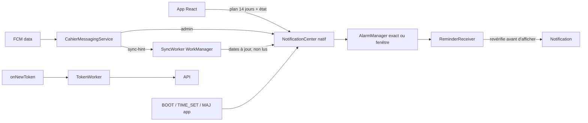

# Circuit de notifications natif — Task 13b

Spécification issue d'une relecture complète du circuit (`CahierMessagingService`,
`NativePushPlugin`, `InboxNotifications`, `nativeNotifications.ts`,
`useNativeReminders`, serveur `nativePush.ts` et `fcm.ts`) **et du manifeste
fusionné de la dernière build**. Rien n'a encore été testé sur un téléphone :
chaque point ci-dessous porte donc un protocole de vérification.

## État vérifié dans le code

| Constat | Preuve |
| --- | --- |
| Rappels peu fiables en veille : `allowWhileIdle: false` | `src/platform/nativeNotifications.ts:64` |
| Aucune permission d'alarme exacte déclarée | manifeste de l'app = `INTERNET`, `ACCESS_NETWORK_STATE` ; manifeste du plugin = `RECEIVE_BOOT_COMPLETED`, `WAKE_LOCK`, `POST_NOTIFICATIONS` |
| Canaux créés deux fois, noms français en dur | `nativeNotifications.ts:56` (« Mon cahier de textes », importance 3) et `:95` (`cahier-reminders-quiet`, même nom) ; `InboxNotifications.java:35` (« Rappels de séances ») ; `:27` (« Messages · Mon cahier de textes ») |
| Canal « Messages de la direction » silencieux | `InboxNotifications.java:27-31` : `IMPORTANCE_DEFAULT` + `setSound(null, null)` + `enableVibration(false)` |
| Couleur de notification hors charte | `InboxNotifications.java:92` : `Color.rgb(66, 85, 255)` = `#4255ff`, dupliqué dans `capacitor.config.ts:12` (`iconColor`) |
| Aucune action rapide | aucun `addAction` dans `InboxNotifications.java` |
| Confidentialité déjà partielle | `VISIBILITY_PRIVATE` présent (`InboxNotifications.java:96` et `:113`) |

Circuits actuels : messages de la direction = fiable (FCM data haute priorité +
vérification du `binding` + notification groupée avec compteur) ; rappels de
séance = **faible** ; badge et état = correct.

## Décision retenue : option (a)

**`SCHEDULE_EXACT_ALARM` déclaré, accord explicite demandé au professeur, repli
sur une fenêtre de 5 minutes si l'accord est refusé.**

Motifs :

1. **La valeur pédagogique est l'instant.** Un rappel « 5 min avant la fin » qui
   arrive après la sonnerie n'a plus d'utilité : la fenêtre seule (option b) ne
   satisfait pas le besoin qui a motivé la fonctionnalité.
2. **Conformité Play.** `USE_EXACT_ALARM` est accordé d'office mais **réservé aux
   applications de réveil et d'agenda** : le déclarer ici exposerait à un refus
   de publication. On ne l'utilise donc **pas**.
3. **Dégradation progressive.** Sans accord, le plugin programme
   `setAndAllowWhileIdle` : le rappel perce la veille profonde mais peut dériver
   de quelques minutes. La fonctionnalité reste utile et l'écran de diagnostic
   explique comment obtenir l'heure exacte.

Conséquence technique, **vérifiée dans le plugin installé**
(`LocalNotificationManager.java:380-392`) : il choisit lui-même
`setExactAndAllowWhileIdle` quand `canScheduleExactAlarms()` est vrai et
`setAndAllowWhileIdle` sinon. Aucun ordonnanceur natif maison n'est donc
nécessaire : `allowWhileIdle: true` (fait) suffit, la permission déclarée
ouvrant seulement la voie exacte.

## Architecture cible

Principe : **le natif possède les notifications, le JS ne fait que fournir les
données.**

1. **`NotificationCenter` natif unique** — **fait (tranche 1)** :
   `NotificationCenter.java` crée les canaux **une fois** (marqueur de version +
   langue), avec des noms localisés fr/ar/en, et supprime les canaux hérités
   `cahier-reminders-quiet` / `cahier-reminders-vibrate`. Trois canaux :
   `cahier-messages` (silencieux + pastille, comportement existant conservé —
   Android ignore un changement d'importance sur un canal déjà créé),
   `cahier-reminders` (son et vibreur réglables par le professeur dans Android),
   `cahier-tests`. Le JS ne crée plus aucun canal et `MainActivity.onCreate`
   garantit leur existence avant qu'un rappel planifié ne soit tiré.
2. **Rappels gérés côté natif** : le JS envoie un plan de 14 jours ; le natif
   programme `setExactAndAllowWhileIdle` (accord) ou `setWindow` (repli), et
   reprogramme sur `BOOT_COMPLETED`, `TIME_SET`, `TIMEZONE_CHANGED`,
   `MY_PACKAGE_REPLACED` et changement d'autorisation. Un `PeriodicWorkRequest`
   quotidien prolonge le plan **sans ouvrir l'app**. Le récepteur revérifie
   l'état local (date saisie, vacances, absence) **juste avant** d'afficher.
3. **Propagation par `sync-hint`** : une fonction serveur unique
   `notifyOwner(phone, event)` envoie un FCM `sync-hint` (priorité normale,
   `collapse_key`) ; le `SyncWorker` récupère dates et non-lus puis annule les
   rappels devenus inutiles → plus de faux « date oubliée » saisis sur le web.
4. **Jeton toujours à jour** : `onNewToken` déclenche un `TokenWorker` qui
   réinscrit l'appareil via l'API (le cookie de session est déjà partagé par
   `CapacitorHttp`/`CookieManager`), plus une vérification hebdomadaire.
5. **Secours sans Google Play** (Huawei, Lenovo, Tecno) : si `available()` est
   faux, un `PeriodicWorkRequest` de 15 min (réseau requis, batterie non faible)
   interroge `GET /api/notify?action=inboxStatus`.
6. **Notification de message plus utile** : groupes et compteur conservés, action
   **« Marquer comme lu »** (accusé par WorkManager, sans ouvrir l'app) et
   « Ouvrir » ; contenu masqué sur écran verrouillé (`VISIBILITY_PRIVATE` déjà
   présent + version publique « 1 nouveau message »).
7. **Autorisations (AGENTS.md)** : écran de préparation avant `POST_NOTIFICATIONS`
   (Android 13+), seconde étape optionnelle vers les alarmes exactes (Android
   12+), guide par fabricant pour l'optimisation de batterie — **aucune demande
   d'exemption automatique** (restreinte par Play).
8. **Écran « Diagnostic des notifications »** dans « Compte et données » :
   autorisation, chaque canal (actif/coupé), alarmes exactes, optimisation de
   batterie, Play disponible, inscription serveur, date du dernier push, prochain
   rappel — chaque défaut avec un bouton qui ouvre le bon réglage ; bouton
   « Tester » avec latence.

Téléphone et tablette partagent le même APK ; sur tablette s'ajoutent le secours
sans Play, la notification privée et le paysage sur l'écran de diagnostic.

## Points de recoupement avec les autres tâches

- **T9 (tâche planifiée)** porte la *politique* d'envoi quotidien (1 → 3
  créneaux). 13b porte l'*exécution native* (canaux, plan, workers, récepteurs).
  Le rappel de retard supprimé avec le Web Push (T3) revient par ces deux
  tâches, côté FCM uniquement.
- **Point 3 (`sync-hint`)** est rattaché à la **Task 18**, comme proposé.
- Les couleurs et les textes viennent des tokens et de l'i18n (Phase 3), donc
  13b se place **après** la Phase 3.

## Vérification

- Tests instrumentés API 23, 29, 34 et 36.
- Doze forcé (`adb shell dumpsys deviceidle force-idle`) avec un rappel
  programmé : il doit arriver dans la fenêtre prévue.
- Redémarrage, changement d'heure, mise à jour de l'APK : rappels reprogrammés.
- Rotation du jeton FCM : réinscription **sans** ouvrir l'app.
- Date saisie sur le web : le rappel « date oubliée » est annulé sur le téléphone.
- `adb shell dumpsys notification`, puis contrôle manuel sur un vrai Xiaomi et un
  vrai Samsung (l'émulateur ne peut pas simuler ces surcouches).
